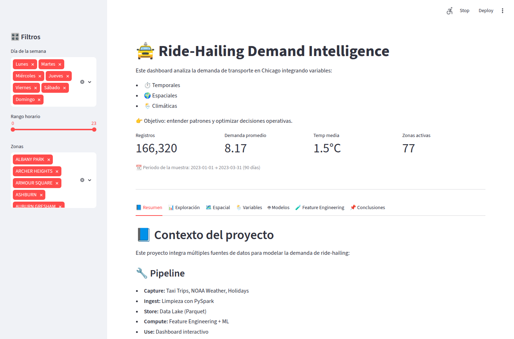
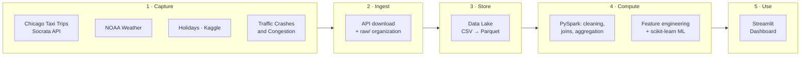
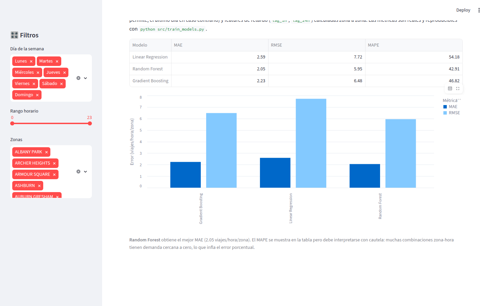
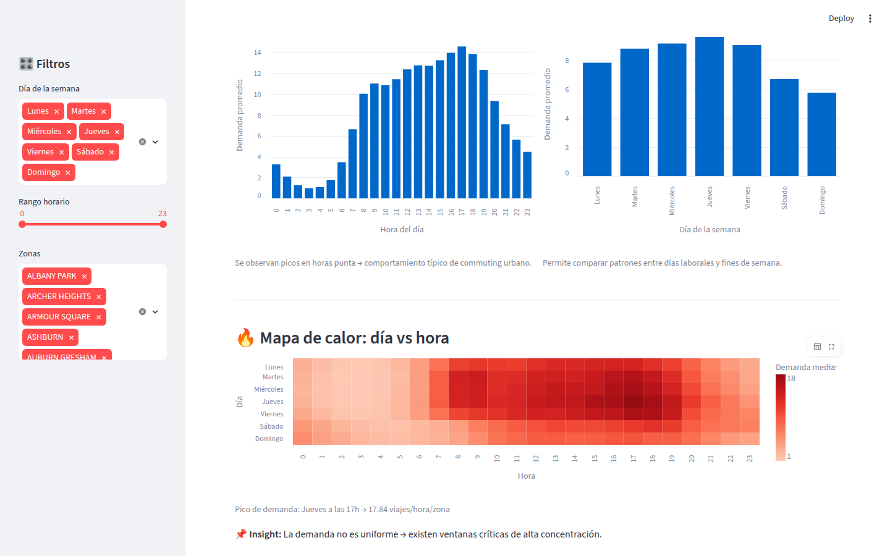
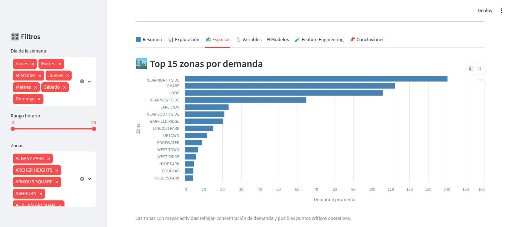
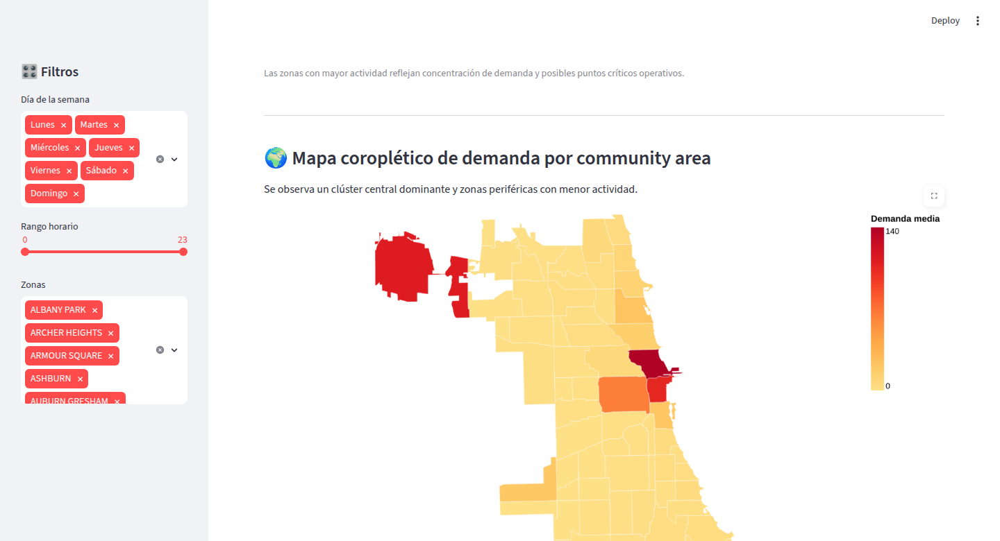
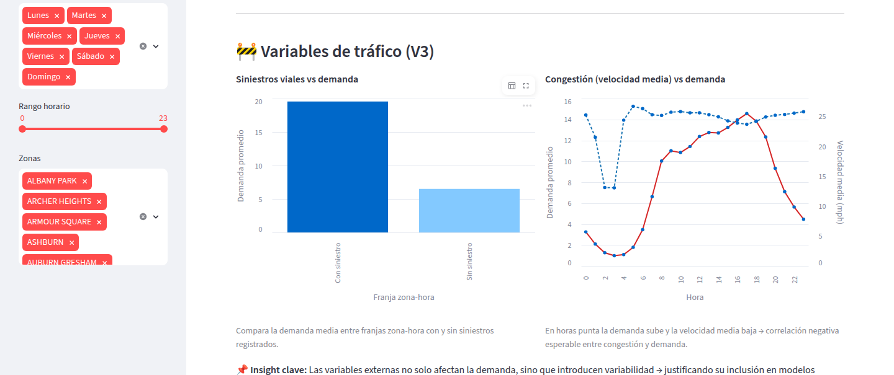

# 🚖 Ride-Hailing Demand Intelligence — Chicago

[](https://www.python.org/)
[](https://spark.apache.org/docs/latest/api/python/)
[](https://streamlit.io/)
[](https://scikit-learn.org/)
[](LICENSE)

**End-to-end Data Science and Big Data project**: spatio-temporal analysis and prediction of ride-hailing demand in Chicago, from distributed data ingestion with **Apache Spark** to an **interactive Streamlit dashboard** with Machine Learning models evaluated through temporal validation.

### 🔴 Live demo

**👉 [ridehailing-demand-dashboard.streamlit.app](https://ridehailing-demand-dashboard-8tlsffpqh7rnwgowc95ljh.streamlit.app/)**



The dashboard runs on the full analytical dataset generated by the pipeline: **90 days** (January–March 2023) × 24 hours × 77 Chicago zones, with temporal, spatial, weather, holiday, and traffic variables.

---

## 🎯 The problem

Urban transportation demand is highly variable: it depends on the time of day, the zone, the weather, and the calendar. Accurately estimating how many trips will be requested in each zone and time slot enables **optimized fleet allocation, reduced wait times, and improved operational efficiency**.

This project builds a complete pipeline that integrates heterogeneous sources (trips, weather, holidays, traffic) and trains predictive demand models at the **zone × hour** level.

---

## 🧱 Architecture (5 layers)



| Layer | What happens | Technology |
|---|---|---|
| **Capture** | Source identification: Taxi Trips, Taxi Zones, NOAA Weather, holidays, crashes, and traffic congestion | Socrata/NOAA APIs, Kaggle |
| **Ingest** | Programmatic download, verification, and organization by source | Python, requests, Kaggle API |
| **Store** | Data Lake with a *raw* layer (CSV) and a *curated* layer (Parquet) | Parquet, Google Drive |
| **Compute** | Cleaning, joins across sources, zone×hour aggregation, feature engineering, and modeling | PySpark, pandas, scikit-learn |
| **Use** | Interactive dashboard with exploration, maps, and model comparison | Streamlit, Altair |

The full pipeline is documented and commented in [`notebooks/ride_hailing_demand_pipeline.ipynb`](notebooks/ride_hailing_demand_pipeline.ipynb).

---

## 🔬 Key methodology

- **Leakage-free lag features**: `lag_1h` and `lag_24h` computed **zone by zone** (groupby + shift over chronologically sorted data), using only information available in production.
- **Strict temporal split**: past and future are never mixed; the test set is always a full period after training.
- **Rolling-window validation** (in the notebook): 4 consecutive test windows with expanding training, reporting mean ± error deviation.
- **Ablation study**: each model is trained with and without lags on exactly the same train/test split to isolate the real contribution of the features.
- **Honest, reproducible metrics**: the dashboard's metrics are not hardcoded; they are generated by [`src/train_models.py`](src/train_models.py) from the repository's data.

---

## 🤖 Model results

Metrics on the full 90-day dataset (test = last complete calendar week, March 25–31, 2023, temporal split). Reproducible with `python src/train_models.py`:

| Model | MAE (with lags) | RMSE (with lags) | MAE (without lags) |
|---|---:|---:|---:|
| Linear Regression | 2.59 | 7.72 | 12.39 |
| **Random Forest** | **2.05** | **5.95** | 2.36 |
| Gradient Boosting | 2.23 | 6.48 | 5.45 |

**Key takeaways:**

- **Random Forest** is the best model in both MAE and RMSE on the full dataset.
- **Lag features drastically reduce error** in Linear Regression and Gradient Boosting (up to 5x less error); in Random Forest the margin is smaller because the model already captures much of the hourly pattern through the other variables.
- MAPE should be interpreted with caution in this problem: many zone-hour combinations have demand close to zero, which inflates the percentage error.



---

## 📊 The dashboard

**[Try it live →](https://ridehailing-demand-dashboard-8tlsffpqh7rnwgowc95ljh.streamlit.app/)**

Seven tabs: project overview, temporal exploration, spatial analysis, impact of external variables, model comparison, feature engineering study, and conclusions. All temporal views show weekdays by name, ordered Monday through Sunday.

**Temporal patterns** — day × hour heatmap with clearly visible commuting peaks on weekdays and notably lower demand on weekends:



**Spatial concentration** — Near North Side and the Loop dominate demand; O'Hare emerges as the second-largest hub by volume, isolated from the central urban cluster:



The **choropleth map by community area** visually confirms the pattern: the central cluster and O'Hare (in red) concentrate demand against a much colder periphery:



**Traffic variables (V3)** — demand is nearly 3 times higher in zone-hour slots with recorded crashes, and congestion (average speed) drops right as demand rises during rush hour:



---

## 🚀 How to run it

```bash
git clone https://github.com/Grohle/Ridehailing-demand-dashboard.git
cd Ridehailing-demand-dashboard

python -m venv .venv && source .venv/bin/activate   # on Windows: .venv\Scripts\activate
pip install -r requirements.txt

# (optional) regenerate model metrics
python src/train_models.py

# launch the dashboard
streamlit run app.py
```

The full pipeline notebook (`notebooks/`) is designed for **Google Colab**: it mounts Google Drive as the Data Lake and downloads the original data from the Chicago, NOAA, and Kaggle APIs (requires your own `kaggle.json`).

---

## 📁 Repository structure

```
├── app.py                    # Streamlit dashboard (Use layer)
├── src/
│   └── train_models.py       # Reproducible model training and evaluation
├── notebooks/
│   └── ride_hailing_demand_pipeline.ipynb   # Full pipeline (5 layers, PySpark)
├── data/
│   ├── final_dataset.csv     # Analytical zone×hour dataset (90 days, 77 zones)
│   ├── chicago_geo.json      # GeoJSON of Chicago community areas
│   └── model_metrics.csv     # Metrics generated by src/train_models.py
├── assets/                   # Dashboard screenshots
├── requirements.txt
└── LICENSE
```

> **Note on the data:** the repo includes the full analytical dataset generated by the pipeline (90 days × 24 h × 77 zones = 166,320 rows, January–March 2023), with temporal, spatial, weather, holiday, and traffic variables (crashes and congestion). It is exactly the dataset produced by the notebook's `curated/` layer, exported to CSV so that the dashboard and training are reproducible without needing a Spark session.

---

## 📚 Data sources

| Dataset | Source |
|---|---|
| Chicago Taxi Trips | [Chicago Data Portal (Socrata)](https://data.cityofchicago.org/Transportation/Taxi-Trips/wrvz-psew) |
| Chicago Community Areas | [Chicago Data Portal](https://data.cityofchicago.org/Facilities-Geographic-Boundaries/Boundaries-Community-Areas-current-/cauq-8yn6) |
| Weather | [NOAA Climate Data](https://www.ncdc.noaa.gov/cdo-web/) |
| US Holidays | [Kaggle — World Countries Holidays 2023](https://www.kaggle.com/datasets/dhavalrupapara/world-countries-holidays-dataset-2023) |
| Traffic Crashes / Congestion | [Chicago Data Portal](https://data.cityofchicago.org/) |

---

## ⚖️ Ethical considerations

The analysis reveals a **spatial bias**: demand (and therefore the model) is concentrated in high-income and tourist areas, leaving the South Side of Chicago underrepresented. A real-world deployment should incorporate **territorial equity criteria** (minimum coverage per zone) in addition to pure efficiency.

---

## 👥 Authors

Final project for the **Master's in Data Science and Big Data**:

- Alberto Miranda
- María José Mangas Gutiérrez
- Santiago Ricardo José Mendoza

Distributed under the [MIT](LICENSE) license.
